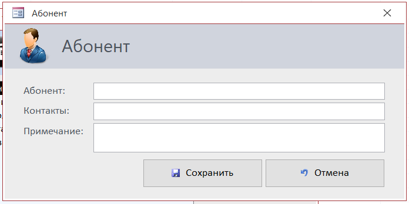

# Проект Телефонный справочник
Разработка 2014 года, реализация на MS Access

## Описание
Приложение для управления базой данных для хранения и поиска телефонных номеров абонентов с добавлением к ним примечаний.

## Функционал
### Управление записями абонентов:
- Добавление
- Поиск
- Правка
- Удаление

## Важно!
Для правильной работы включите макросы.

## Скриншоты
### Главный экран

### Карточка записи

### Создание новой записи

### Поиск записей

